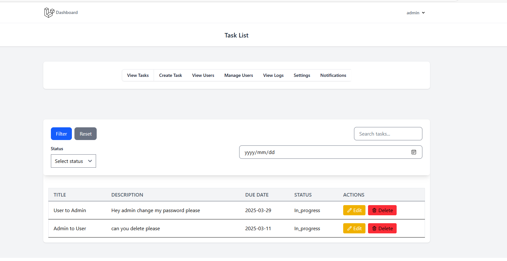
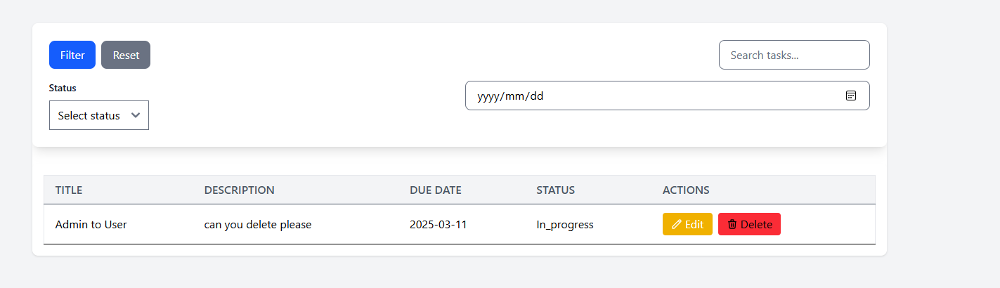
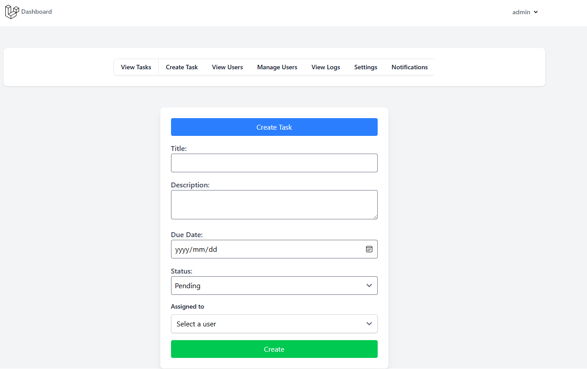
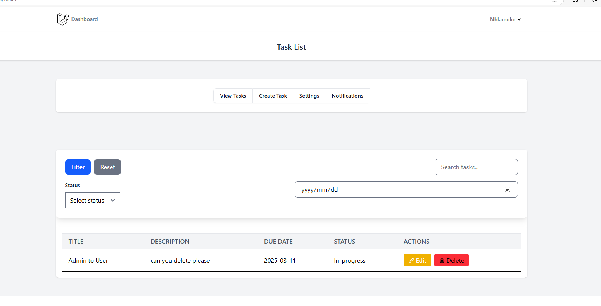
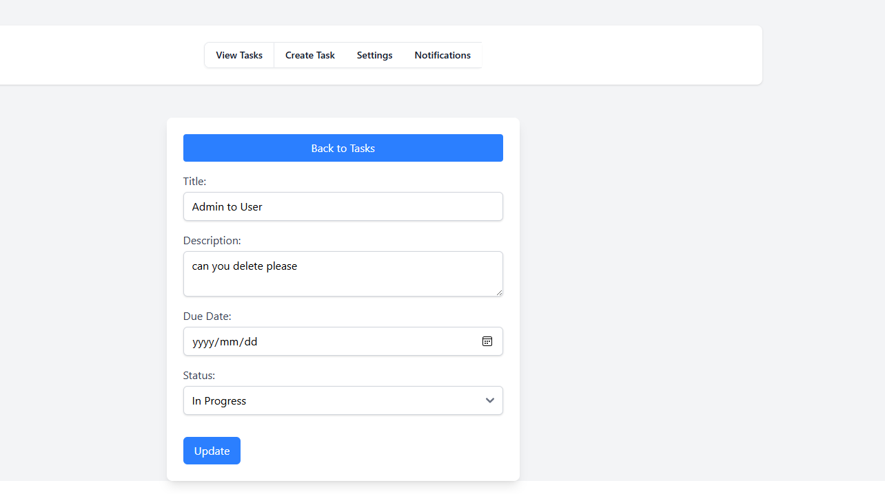
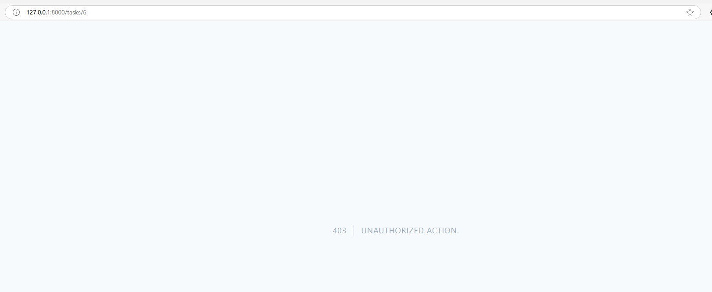

Test the API
I used Postman to test these API's

Register: POST /api/register

Login: POST /api/login

Create Task: POST /api/tasks

Get Tasks: GET /api/tasks

Update Task: PUT /api/tasks/{id}

Delete Task: DELETE /api/tasks/{id}

Admin 

 -> A user assigned a task to admin.

 -> Admin can edit and delete task created by users 

 -> Both user's and admin's can create task 

User

 -> Task created by user ,deleted by admin , only task created by admin now is visible to user

 -> User can edit or reply to the message 

 -> They can not delete task that is not created by him/her 
